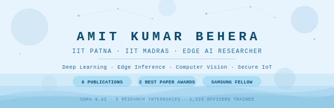

<div align="center">



[](https://git.io/typing-svg)

<a href="mailto:amit_24a12res82@iitp.ac.in"></a>
<a href="https://linkedin.com"></a>
<a href="https://orcid.org"></a>
<a href="https://scholar.google.com"></a>


</div>

---

## 🧭 Research Focus

> *Deploying intelligence where compute is scarce — from satellite imagery to IoT edges.*

```
Edge AI Inference          ████████████████████  Resource-Constrained Systems
Computer Vision            ██████████████████░░  Self-Supervised Learning
Secure IoT & IDS           █████████████████░░░  LLM Deployment on Edge
Remote Sensing / EO        ████████████░░░░░░░░  Embedded Systems
```

---

## 📄 Publications

> **6 papers accepted/published · 2 Best Paper Awards · 2 under review**

### Accepted / Published

| # | Title | Venue | Role |
|---|-------|-------|------|
| 1 | Hybrid Spatial–Temporal Attention Networks for Plant Disease Classification | IEEE AIML App. Conf. | **1st Author** |
| 2 | Performance–Efficiency Tradeoff of Deep CNN for Brain Tumor MRI on Edge | IEEE DICCT | **1st Author 🏆 Best Paper** |
| 3 | AgriEdge: LoRa-Based Edge IoT Smart Irrigation for Precision Agriculture | IJFMR Vol. 8 | **1st Author** |
| 4 | EdgeGuard: Lightweight AI-Driven IDS for Real-Time Cyberattack Mitigation | IEEE | 2nd Author 🏆 Best Paper |
| 5 | Learning EO Embeddings with Temporal & Non-Temporal Self-Supervision (RCF) | ITAI 2026, Springer LNNS | 2nd Author |
| 6 | Comprehensive Performance Eval. of Ollama-Based LLMs on Heterogeneous Edge | NICEDT 2026, Springer LNNS | 2nd Author |

### 🔄 Under Review

- **Multi-Environment Evaluation of Edge-Based LoRa Communication** — IEEE Intl. Conf. on Instrumentation *(1st Author)*
- **AI-Driven Blood Group Detection from Fingerprints with Quantized Edge Inference** — IEEE ICAIHC 2026 *(1st Author)*

---


## 🛠️ Tech Stack

### AI / ML & Deep Learning


### Edge AI & Deployment


### Programming & Tools


---

## 📊 GitHub Stats

<div align="center">


</div>


---

## 🤝 Let's Connect

<div align="center">

*Open to research collaborations in Edge AI, Computer Vision, and Embedded Intelligence.*

[](mailto:amit_24a12res82@iitp.ac.in)
[](tel:+917981971154)

</div>

---

<div align="center">
<sub>IIT Patna · IIT Madras · Researching at the intersection of AI and constrained hardware</sub>
</div>
